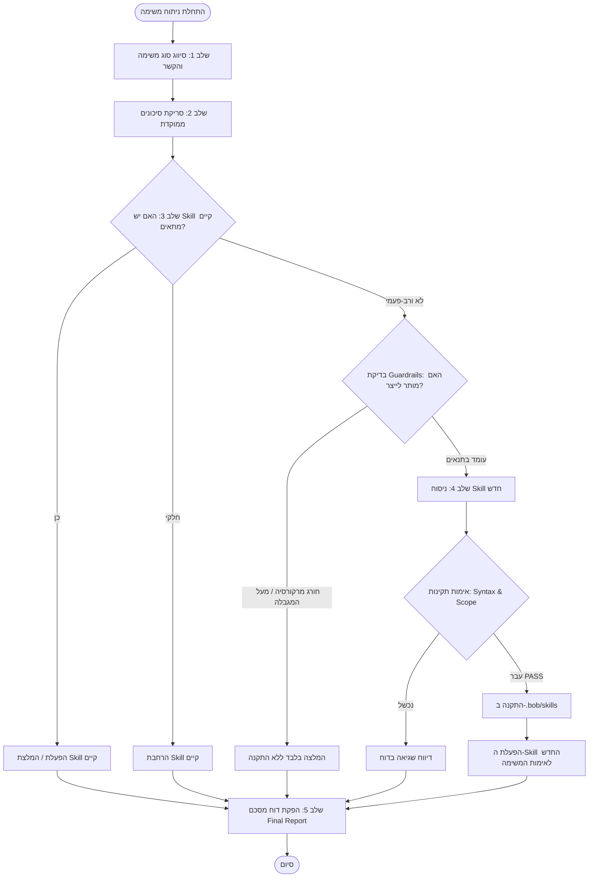

# Code Awareness & Automated Skill Lifecycle — מדריך מקיף וניתוח ה-Skill

> **קובץ הדרכה והסבר מעמיק** על ה-Skill החדשני: `code-awareness` (גרסת ה-Automated Skill Lifecycle).  
> מסמך זה מפרק את המבנה, אופן הפעולה, שלבי הביצוע, מנגנוני הבטיחות (Guardrails), ומצבי העבודה השונים.

---

## תוכן עניינים

1. [סקירה כללית: מהו Skill זה?](#1-סקירה-כללית-מהו-skill-זה)
2. [המטא-דאטה והפרונטמאטר (Frontmatter)](#2-המטא-דאטה-והפרונטמאטר-frontmatter)
3. [מצבי פעולה (Modes)](#3-מצבי-פעולה-modes)
4. [עקרונות בטיחות וגבולות גזרה (Guardrails)](#4-עקרונות-בטיחות-וגבולות-גזרה-guardrails)
5. [שלבי ביצוע מפורטים (Step-by-Step Execution)](#5-שלבי-ביצוע-מפורטים-step-by-step-execution)
6. [תרשים זרימת עבודה (Architecture & Workflow)](#6-תרשים-זרימת-עבודה-architecture--workflow)
7. [מבנה הפלט והדוח הסופי (Final Report)](#7-מבנה-הפלט-והדוח-הסופי-final-report)
8. [דוגמה מעשית מהשטח](#8-דוגמה-מעשית-מהשטח)
9. [סיכום והשוואה ל-Skills קלאסיים](#9-סיכום-והשוואה-ל-skills-קלאסיים)

---

## 1. סקירה כללית: מהו Skill זה?

ה-Skill בשם **`code-awareness`** מייצג קפיצת מדרגה מ-Skill רגיל (שמבצע רק בדיקה פסיבית או המלצה) למנגנון **Meta-Skill / Agentic Lifecycle**:

- **ניתוח משימות טכניות**: בוחן את ההקשר של המשימה (לפני הביצוע — Pre-execution, או אחריו — Post-execution).
- **איתור פערים ביכולות (Capability Gap Detection)**: מזהה אילו יכולות נדרשות לביצוע המשימה או לבדיקתה ומשווה אותן ל-Skills שכבר מותקנים במערכת.
- **הערכת סיכונים ממוקדת**: סורק רק את משטחי הסיכון הרלוונטיים לסוג המשימה שבוצעה (למשל: סכמות נתונים, אימות/הרשאות, תלויות ותשתית).
- **ייצור והתקנה אוטומטיים של Skills**: כאשר מזוהה פער רב-פעמי שאינו מכוסה, ה-Skill מנסח, מוודא (Validation) ומתקין Skill חדש ייעודי באופן מיידי דרך מנגנון יצירת ה-Skills.
- **הפעלת ה-Skill החדש**: מריץ את היכולת החדשה שנוצרה כדי להשלים או לאמת את המשימה.

---

## 2. המטא-דאטה והפרונטמאטר (Frontmatter)

```yaml
---
name: code-awareness
description: >
  Analyzes technical and coding tasks (pre-execution or post-execution)
  to detect missing capabilities, identify relevant installed skills,
  and automatically generate or install validated new skills via the
  skill-creation workflow when gaps are detected.
metadata:
  argument-hint: "[optional task description or execution context]"
  default-mode: auto-create
  generated-skills-per-run: 1
  recursion-depth: 0
---
```

### ניתוח השדות:
- **`name: code-awareness`**: השם התקני (ב-`kebab-case`) שמזהה את ה-Skill.
- **`description` (הטריגר האוטומטי)**: מנחה את Bob לטעון את ה-Skill בכל פעם שיש צורך בניתוח משימות טכניות, גילוי יכולות חסרות, או יצירת Skills אוטומטית בהתאם לפערים.
- **`metadata.argument-hint`**: מאפשר למשתמש להעביר תיאור משימה אופציונלי בעת הפעלה ידנית (למשל: `/code-awareness Added JWT auth endpoint`).
- **`metadata.default-mode: auto-create`**: מגדיר שמצב ברירת המחדל הוא יצירה והתקנה אוטומטית של כישורים חסרים ברמת קריאה/הערכה.
- **`metadata.generated-skills-per-run: 1`**: הגבלה למקסימום Skill אחד חדש פר הרצה בודדת.
- **`metadata.recursion-depth: 0`**: מניעת לולאות אינסופיות (Anti-Recursion).

---

## 3. מצבי פעולה (Modes)

ה-Skill תומך ב-3 מצבי עבודה שונים:

| מצב (Mode) | אופן פעולה | התנהגות הרשאות ובטיחות |
|---|---|---|
| **`auto-create`** *(ברירת מחדל)* | מייצר, מאמת ומתקין אוטומטית Skills מסוג קריאה/הערכה (Read/Eval). | דורש אישור מפורש של המשתמש עבור Skills בעלי הרשאות ביצוע גבוהות (High-privilege execution). |
| **`recommend`** | מזהה פערים ומציע Skills קיימים או טיוטה (Draft) של Skill חדש. | **ללא התקנה בפועל** — המלצה בלבד למשתמש. |
| **`execute`** | מריץ באופן ישיר Skills מאומתים שכבר קיימים או הותקנו. | הפעלה מיידית של הבדיקה או המשימה. |

---

## 4. עקרונות בטיחות וגבולות גזרה (Guardrails)

כדי להבטיח שהמודל לא ייצור עומס או ישבש את סביבת הפיתוח, מוגדרים 4 כללי ברזל:

1. **Single-Skill Cap (תקרת יצירה בודדת)**:
   - מקסימום **Skill אחד בלבד** נוצר בכל הרצה של משימה, למניעת הצפה של המערכת (Skill Bloat).
2. **Anti-Recursion (מניעת רקורסיה)**:
   - אם המשימה הנוכחית של הסוכן היא בעצמה יצירה או עריכה של Skill — **נאסר עליו לייצר Skill חדש נוסף**.
3. **No Duplication (מניעת כפילויות)**:
   - העדפה תמידית לשימוש ב-Skill קיים או הרחבה מינימלית שלו על פני יצירת Skill כפול.
4. **Verification Gate (שער אימות ובקרת איכות)**:
   - Skill חדש יותקן **אך ורק** אם עבר בהצלחה (`PASS`) שלושה תנאים:
     - תקינות תחבירית (Syntax).
     - גבולות גזרה והרשאות מוגדרים היטב (Scope restriction).
     - טריגר איכותי ומדויק ב-description למניעת הפעלות שווא (Trigger quality).

---

## 5. שלבי ביצוע מפורטים (Step-by-Step Execution)

```
┌────────────────────────────────────────────────────────┐
│  שלב 1: סיווג המשימה והיכולות הנדרשות                  │
│  (Capability & Task Classification)                    │
└──────────────────────────┬─────────────────────────────┘
                           │
┌──────────────────────────▼─────────────────────────────┐
│  שלב 2: סריקת סיכונים ממוקדת לפי סוג המשימה            │
│  (Targeted Risk Scan)                                  │
└──────────────────────────┬─────────────────────────────┘
                           │
┌──────────────────────────▼─────────────────────────────┐
│  שלב 3: ניתוח פערי Skills                              │
│  (Skill Gap Analysis)                                  │
└──────────────────────────┬─────────────────────────────┘
                           │
┌──────────────────────────▼─────────────────────────────┐
│  שלב 4: ייצור והתקנה ישירה (במידה ויש פער)             │
│  (Generation & Direct Installation)                    │
└──────────────────────────┬─────────────────────────────┘
                           │
┌──────────────────────────▼─────────────────────────────┐
│  שלב 5: הפקת דוח מסכם                                  │
│  (Final Report)                                        │
└────────────────────────────────────────────────────────┘
```

### שלב 1: סיווג המשימה והיכולות (Capability & Task Classification)
- זיהוי סוג המשימה (`feature`, `bugfix`, `refactor`, `infra`, `db`, `security`, `pipeline`).
- ניתוח ההקשר: אילו קבצים שונו, באילו כלים נעשה שימוש, מה התבקש.
- הגדרת היכולות הנדרשות: למשל בדיקת AST, בדיקת Rollback של סכמה, בדיקות Contract וכד'.

### שלב 2: סריקת סיכונים ממוקדת (Targeted Risk Scan)
במקום לסרוק הכל, נסרקים רק משטחי הסיכון הרלוונטיים למשימה הספציפית:
- **בעת שינוי נתונים/מודלים (`data/models`)**: בטיחות מיגרציה, נתיב Rollback, מניעת דליפת פרטיות (PII).
- **בעת שינוי Endpoints או הזדהות (`endpoints/auth`)**: חיטוי קלטים (Sanitization), מניעת עקיפת הרשאות, ניהול מפתחות וסיסמאות.
- **בעת שינוי תלויות/תשתית (`dependencies/infra`)**: וקטורי פגיעות ספריות, כשלי Pipeline.

### שלב 3: ניתוח פערים, חיפוש ושליפת Skills מהרשת (Search & Fetch First)
סדר עדיפויות מוחלט:
1. **בדיקה מקומית**: בדיקת ה-Skills המותקנים בפרויקט (`.bob/skills/`) ובסביבה הגלובלית.
2. **חיפוש ושליפה מהאינטרנט (Web Search & Fetch)**:
   - **עדיפות 1 — Skill רשמי של היצרן (Official Vendor Skill)**: סריקת מאגרי היצרן (כגון IBM, אנתרופיק, ארגוני קוד רשמיים ב-GitHub) לשליפת קובץ `SKILL.md` מקורי.
   - **עדיפות 2 — Skill מומלץ מהקהילה / קוד פתוח מוביל**: סריקה ב-MCP Registries / Marketplaces / GitHub.
   - **השוואת פתרונות**:
     - 💎 **פתרון פרימיום / בתשלום** (SaaS / שירות מנוהל עם תמחור ויכולות מתקדמות).
     - 🟢 **הפתרון החינמי הטוב ביותר** (קובץ `SKILL.md` רשמי או קוד פתוח להורדה ישירה).
3. **שליפת קבצים בלבד (ללא מדריכים/קישורים)**:
   - הורדה ישירה של קובץ ה-`SKILL.md` (וסקריפטים נלווים) ישירות לדיסק.

### שלב 4: התקנה ישירה מול בנייה מותאמת (Install vs. Fallback Build)
- **מסלול ראשי — נמצא Skill קיים ברשת**: הורדה, אימות והתקנה ישירה. **אין לבנות Skill מאפס אם קיים Skill של היצרן או של הקהילה!**
- **מסלול Fallback — רק אם לא קיים שום Skill ברשת**: רק כאשר חיפוש מקיף מוכיח שאין שום Skill רשמי או קהילתי, רק אז מנוסח ונבנה Skill חדש מאפס.

### שלב 5: הפקת דוח מסכם (Final Report מונגש למשתמש)
הפקת פלט מובנה הכולל:
- **Task Summary**: סוג המשימה, רכיבים עיקריים וסטטוס.
- **Identified Gaps**: יכולות שנדרשו אך היו חסרות.
- **Recommendations & Options (חינמי מול בתשלום)**:
  - 🟢 **האפשרות החינמית הטובה ביותר** (Skill מקומי או MCP חינמי).
  - 💎 **אפשרות Premium / Paid** (במידה וקיימת, עם תמחור ויתרונות).
- **Skill Actions**: פירוט אילו Skills/MCPs הומלצו, נוצרו או הותקנו.
- **Next Steps & Guidance**: הנחיות התקנה פשוטות וברורות למימוש המשימה.

---

## 6. תרשים זרימת עבודה (Architecture & Workflow)



---

## 7. מבנה הפלט והדוח הסופי (Final Report)

הפלט המופק בסיום הריצה הוא מובנה וקצר:

```text
📋 Code Awareness & Skill Lifecycle Report
==========================================
Task Summary:
- Type: auth-change (Added OAuth2 Google login flow)
- Status: Completed / Ready for review
- Key Files: src/auth/oauth.ts, api/routes/auth.ts

Identified Gaps:
- Missing automated verification for OAuth token replay attack prevention.

Skill Actions:
- [Existing] Invoked: `security-review` (Found 0 high-severity issues)
- [Generated & Installed]: `oauth-flow-validator` in `.bob/skills/oauth-flow-validator/SKILL.md`
- [Executed]: Ran `oauth-flow-validator` on `src/auth/oauth.ts` -> PASS

Next Steps:
- Add integration tests for edge-case token expiration.
- Ready for PR creation.
```

---

## 8. דוגמה מעשית מהשטח

### תרחיש:
מפתח מוסיף שינוי סכמה בבסיס נתונים (`src/db/migrations/003_add_tenant_id.sql`).

1. **שלב 1 (סיווג)**: סווג כ-`db`.
2. **שלב 2 (סריקת סיכונים)**: נבדקים סיכוני נעילת טבלאות, חוסר ב-Rollback, ודליפת מידע בין Tenants.
3. **שלב 3 (בדיקת פערים)**: 
   - האם קיים `db-migration`? אם קיים — יופעל.
   - אם חסר Skill לווידוא Rollback דטרמיניסטי — מזוהה פער רב-פעמי.
4. **שלב 4 (ייצור והתקנה)**: ה-Skill מייצר את `.bob/skills/db-rollback-check/SKILL.md`, מוודא שהוא תקין ומתקין אותו.
5. **שלב 5 (דוח סופי)**: מוצג הדוח עם המלצות ופירוט הפעולות שבוצעו.

---

## 9. סיכום והשוואה ל-Skills קלאסיים

| מאפיין | Skill קלאסי (Passive) | `code-awareness` (Active Lifecycle) |
|---|---|---|
| **תפקיד** | מבצע סדרת הוראות קבועה מראש | מנתח את מצב המערכת, מזהה פערים ומגיב אליהם |
| **טיפול בחוסרים** | נכשל או מדלג אם חסר כלי | מייצר ומתקין אוטומטית את ה-Skill החסר |
| **בטיחות ומניעת לולאות** | לא נדרש (סטטי) | מכיל Guardrails קשיחים (Single-cap, Anti-recursion) |
| **התאמה דינמית** | קבועה מראש לפי הקובץ | דינמית לפי סוג המשימה ומשטחי הסיכון שלה |

---
*מסמך זה נוצר ב-Bob — IBM Agentic AI ומספק הסבר מלא על קובץ ה-Skill `code-awareness`.*
